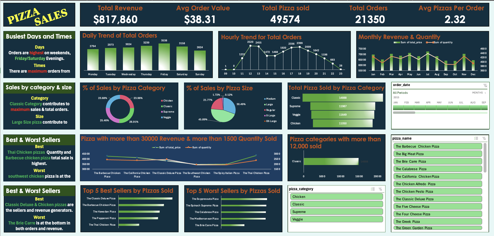

# 🍕 Pizza Sales Analytics Project  
*MySQL-Based Sales Analysis with a Connected Excel Dashboard*

---

## 🧭 Project Overview

This project analyzes transactional pizza sales data using **MySQL** and visualizes key business insights through an **interactive Excel dashboard connected directly to the SQL database**. The objective is to extract actionable insights around revenue, product performance, and ordering trends to support business decisions.

---

## 🔍 Goals of the Project

- Analyze pizza sales and performance using SQL
- Explore order behavior by time, size, and category
- Identify top-performing and underperforming products
- Visualize insights using an interactive dashboard with real-time data from SQL

---

## 📈 Outcomes

- Connected **Excel directly to MySQL** to support real-time dashboard refresh
- Identified peak ordering **days and hours**, helping optimize staffing and promotions
- Revealed the **most and least popular pizzas** by quantity and revenue
- Showed **category and size-based revenue contributions**, guiding inventory and pricing strategies
- Delivered a **comprehensive dashboard** for non-technical stakeholders to explore data independently

---

## 📊 Key Dashboard Features

- **KPI Cards**: Total Revenue, Orders, Pizzas Sold, Avg. Order Value
- **Trend Visuals**: Daily and hourly order volume (bar/line charts)
- **Sales Composition**:
  - Pie chart by pizza category and size
  - Funnel chart of pizzas sold by category
- **Product Rankings**:
  - Top 5 best-selling pizzas
  - Bottom 5 worst-selling pizzas
- **Interactivity**: Pivot tables, **slicers**, and **timeline filters** for dynamic filtering

---

## 🧰 Tools & Techniques Used

- **MySQL**:
  - Data cleaning (`STR_TO_DATE`, `TIME`)
  - Advanced queries: `GROUP BY`, `JOIN`, `CTE`, `CASE`, `RANK()`
  - Null handling with `COALESCE`, type compatibility (`INT`, `VARCHAR`, etc.)
- **Excel**:
  - Live connection to MySQL using **ODBC**
  - Dashboard built with pivot tables, slicers, and charts
  - Timeline filter for time-based exploration

---

## 📁 Files Included

| File Name                          | Description                                          |
|-----------------------------------|------------------------------------------------------|
| `pizza_sales_dashboard.xlsx`      | Excel dashboard with SQL connection                  |
| `pizza_sales_dashboard_screenshot.png` | Dashboard preview image                     |
| `pizza_sales.csv`                | Source sales dataset                                 |
| `pizza_sales.sql`                | SQL queries for analysis and cleanup                 |
| `README.md`                      | Project documentation                                |

---

